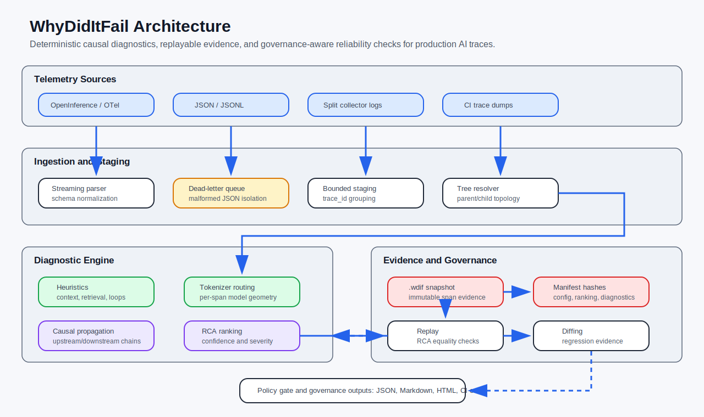
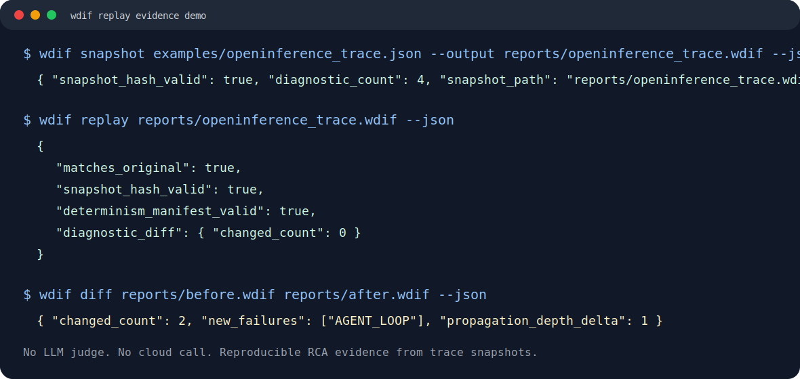

# WhyDidItFail (wdif)

[](https://opensource.org/licenses/MIT)
[](https://www.python.org/)
[](https://github.com/Textualize/rich)

Deterministic causal diagnostics and replayable evidence snapshots for production LLM, RAG, and agent failures, running locally on your CPU for exactly $0 in API calls.

**WhyDidItFail** is deterministic causal diagnostics infrastructure for production agentic systems. It ingests OpenInference/OpenTelemetry-style JSON, reconstructs execution trees, ranks structural root causes, captures immutable `.wdif` evidence snapshots, and replays RCA output later with SHA-256 integrity and determinism-manifest validation.

## Quickstart

```bash
pip install whydiditfail
wdif analyze examples/sample_trace.json --json
wdif snapshot examples/openinference_trace.json --output reports/openinference_trace.wdif
wdif replay reports/openinference_trace.wdif
wdif diff reports/before.wdif reports/after.wdif
```

Local development:

```bash
poetry install
poetry run wdif analyze examples/sample_trace.json --json
poetry run pytest -q
```

## Benchmark

Recent local runs on a 100,000-span synthetic trace land in the 37k-40k logs/sec range depending on background load:

```json
{
  "spans": 100000,
  "logs_per_second": 37207.37,
  "tokens_per_second": 95270.2
}
```

```text
+--------------------------------------------------------------+
| PRODUCTION TRACE STREAM                                      |
| OpenInference / OTel JSON, JSONL, split collector logs        |
+-------------------------------+------------------------------+
                                |
                                | Local CPU ingestion
                                v
+--------------------------------------------------------------+
| WDIF CAUSAL DIAGNOSTIC ENGINE                                |
| Parser | DLQ | bounded staging | heuristics | RCA ranking     |
+-------------------------------+------------------------------+
                                |
                                | Deterministic causal findings
                                v
+--------------------------------------------------------------+
| EVIDENCE SNAPSHOT (.wdif)                                    |
| Span tree | diagnostics | config | determinism manifest       |
| SHA-256 snapshot hash | normalization/ranking/diagnostic hash |
+-------------------------------+------------------------------+
                                |
                                | Replay and diff
                                v
+--------------------------------------------------------------+
| RELIABILITY OUTPUT                                           |
| CI/CD gate | RCA replay verification | regression diff | PR fix|
+--------------------------------------------------------------+
```



Replay verification is intentionally strict:

```json
{
  "matches_original": true,
  "snapshot_hash_valid": true,
  "determinism_manifest_valid": true,
  "diagnostic_diff": {
    "changed_count": 0
  }
}
```



## Design Principles

- **Deterministic over probabilistic**: use structural evidence before probabilistic judgment.
- **Evidence over telemetry**: traces are raw material; replayable RCA is the deliverable.
- **Replayable over ephemeral**: every serious diagnostic should be reconstructible later.
- **Causal graphs over flat metrics**: production AI failures propagate across spans.
- **Local-first infrastructure**: the core engine runs without API calls or cloud dependencies.
- **Governance-aware reliability**: policy exits, manifests, and hashes belong in the core path.

## What It Detects

- **Lost in the middle**: retrieved evidence is buried in the weakest region of a long prompt.
- **Context stuffing**: prompt payload is near or over the configured context budget.
- **Retriever miss**: retrieval returned no documents or only low-confidence documents.
- **Agent loop**: the same tool/agent call repeats with unchanged inputs.
- **Tool error**: tool spans failed before the agent could use their results.
- **Ungrounded answer**: LLM output has weak overlap with retrieved context in the same trace tree.
- **Orphaned span tree**: child spans reference missing parents after staging.

## Enterprise Policy Config

WhyDidItFail supports repository-local policy configuration through `wdif.yaml`, `wdif.yml`, or `wdif.toml`.

```yaml
version: "1.0.0"
tokenizer: "cl100k_base"

exit_codes:
  CRITICAL: 1
  WARNING: 0
  INFO: 0

concurrency: 4

ingestion:
  dead_letter_severity: WARNING
  fail_on_dead_letters: true
  max_context_bomb_characters: 100000

metrics:
  lost_in_the_middle:
    enabled: true
    severity: WARNING
    context_threshold_tokens: 4000
    blindspot_zone: [20.0, 80.0]
  agent_loop:
    enabled: true
    severity: CRITICAL
    max_consecutive_repeats: 5
  orphaned_span_tree:
    enabled: true
    severity: WARNING
```

Use policy-driven CI exits:

```bash
wdif analyze examples/sample_trace.json --config wdif.yaml --policy-exit
wdif stream chaos_dirty_stream.jsonl --config wdif.yaml --dlq chaos.corrupted.log --policy-exit
```

Tokenizer configuration:

- Short form: `tokenizer: "cl100k_base"` uses `tiktoken`.
- Advanced form: use `tokenizer.provider`, `tokenizer.name`, and `tokenizer.local_path` for `tiktoken`, `huggingface`, or `regex`.

## Why It Is Different

1. **Zero API cost**: `wdif` does not call a frontier model to judge trace quality.
2. **Active diagnosis**: it explains failure signatures instead of only showing raw spans.
3. **CI-friendly output**: diagnostics can be emitted as JSON and configured to fail on critical findings.
4. **Trace-tree aware**: grounding checks can compare LLM output against retriever evidence elsewhere in the same execution tree.

## Install From Source

```bash
git clone https://github.com/<your-username>/whydiditfail.git
cd whydiditfail
poetry install
```

## Usage

Analyze the included synthetic agent failure:

```bash
poetry run wdif analyze examples/sample_trace.json
```

Emit JSON for automation:

```bash
poetry run wdif analyze examples/sample_trace.json --json
```

Analyze an OpenInference/OpenTelemetry-style trace:

```bash
poetry run wdif analyze examples/openinference_trace.json
```

Write a shareable report:

```bash
poetry run wdif analyze examples/openinference_trace.json --report reports/openinference_report.md
poetry run wdif analyze examples/openinference_trace.json --report reports/openinference_report.html
```

Inspect the reconstructed execution tree:

```bash
poetry run wdif tree examples/openinference_trace.json
```

Analyze every JSON trace in a directory:

```bash
poetry run wdif batch examples --json --workers 4
```

Stream large JSON/JSONL trace collections:

```bash
wdif stream traces.jsonl --json --dlq traces.corrupted.log
```

Tail a live JSONL trace file and flush staged traces after a short idle window:

```bash
wdif watch traces/live.jsonl --flush-after 2 --dlq traces.corrupted.log
```

Map framework-specific telemetry fields when upstream semantic conventions drift:

```yaml
extraction_mappings:
  prompt: "$.attributes['gen_ai.prompt_text']"
  documents: "$.attributes['custom_retriever.chunks']"
  output_text: "$.attributes['gen_ai.response.text']"
```

Route tokenizers by model metadata inside mixed-model traces:

```yaml
tokenizer: "cl100k_base"
tokenizer_routes:
  - match: "llama"
    provider: "huggingface"
    local_path: "./tokenizers/llama3-tokenizer.json"
  - match: "mistral"
    provider: "huggingface"
    local_path: "./tokenizers/mistral-tokenizer.json"
```

Group spans split across multiple log files by `trace_id` before analysis:

```bash
wdif batch traces/ --staged --dlq traces.corrupted.log --json
```

Fail CI when a critical signature is detected:

```bash
wdif analyze examples/sample_trace.json --fail-on-critical
```

Export offline telemetry analytics:

```bash
wdif export examples --format html --output reports/aggregate.html
```

Capture and replay deterministic evidence snapshots:

```bash
wdif snapshot examples/openinference_trace.json --output reports/openinference_trace.wdif
wdif replay reports/openinference_trace.wdif
wdif diff reports/before.wdif reports/after.wdif
```

## Production Chaos Stream Test

Generate a messy, out-of-order JSONL span stream using OpenInference-style semantic attributes:

```bash
python generate_production_logs.py
```

Inspect the reconstructed tree. Even though child spans are emitted before parents, `wdif` resolves the execution graph by span IDs:

```bash
wdif tree production_traces_dump.jsonl
```

Run streaming diagnostics and write a remediation report:

```bash
wdif stream production_traces_dump.jsonl --config wdif.yaml --report reports/production_stream.md
```

Expected signatures:

- `AGENT_LOOP`: six identical `sql_schema_lookup` tool calls with unchanged SQL input.
- `CONTEXT_STUFFING`: the LLM span exceeds the configured context budget.
- `LOST_IN_THE_MIDDLE`: `DATABASE_REPLICATION_PORT = 9921` is buried around the 50% prompt-depth mark.
- Remediation report: Markdown output includes a Git-style unified diff suggesting how to move the critical chunk to the prompt edge.

`wdif.yaml` currently routes `LOST_IN_THE_MIDDLE` to `WARNING` and `AGENT_LOOP` to `CRITICAL`, mirroring an enterprise policy where operational loops break CI but prompt-layout risks can be triaged.

## Parser Hardening Chaos Test

Generate a dirty stream containing one malformed JSON row and one oversized prompt payload:

```bash
python generate_chaos_logs.py
wdif stream chaos_dirty_stream.jsonl --dlq chaos.corrupted.log --json
```

This verifies:

- malformed JSON is written to a dead-letter queue and does not halt valid rows,
- context-bomb prompts use bounded/estimated token counting instead of monolithic tokenizer allocation,
- diagnostics include `token_count_mode: estimated` when the safety ceiling is engaged.

For distributed collector race conditions where child and parent spans land in different files:

```bash
wdif batch traces/ --staged --dlq traces.corrupted.log --json
```

The staged runner groups spans by `trace_id` across files before reconstructing execution trees.

## Production Hardening

The production ingestion path includes explicit safeguards for common enterprise failure modes:

- **Trace identity**: parsed spans and diagnostics preserve `trace_id` where present.
- **Split-log staging**: `wdif batch --staged` groups spans by `trace_id` across multiple files before analysis.
- **Live tailing**: `wdif watch` follows appended JSONL spans, stages by `trace_id`, and flushes traces after an idle window.
- **Bounded staging**: long-lived or oversized trace groups spill/flush by configured active trace, span-count, and age limits.
- **Schema drift mapping**: `extraction_mappings` lets teams point prompt, document, output, and model fields at custom OpenTelemetry/GenAI layouts.
- **Tokenizer routing**: `tokenizer_routes` selects per-span tokenizers from model metadata and marks fallback geometry explicitly.
- **RCA ranking**: diagnostics include deterministic confidence scores, contributing evidence, and co-occurring failure context.
- **Causal graph analysis**: ranked findings are annotated with upstream/downstream roles, propagation depth, and causal chains.
- **Deterministic replay**: `.wdif` snapshots include immutable span trees, RCA output, config, SHA-256 integrity validation, and a determinism manifest.
- **Orphan detection**: unresolved child spans emit `ORPHANED_SPAN_TREE` diagnostics instead of silently becoming clean roots.
- **Dead-letter queue**: malformed JSON rows are written to a `.corrupted.log` file and valid rows continue processing.
- **DLQ policy exits**: set `ingestion.fail_on_dead_letters: true` and map `dead_letter_severity` through `exit_codes`.
- **Config validation**: invalid tokenizer providers, unknown heuristics, bad severities, and non-numeric thresholds fail fast with readable errors.
- **Context-bomb protection**: huge prompts use bounded/estimated token counting and include `token_count_mode: estimated`.
- **Privacy controls**: diagnostic metadata is redacted and truncated before JSON/report output, preserving metrics while hiding obvious credentials, emails, and long token-like strings.

## Corporate CI/CD Policy Gate Simulation

Run a local simulation of an enterprise GitHub Pull Request validation job:

```bash
python test_company_pipeline.py
```

The harness:

- emits an out-of-order OpenInference JSONL trace stream,
- writes a temporary strict CI policy where `LOST_IN_THE_MIDDLE` is `CRITICAL`,
- reconstructs the execution tree locally,
- runs the deterministic diagnostic engine,
- writes `reports/company_pipeline_report.md`,
- exits with status code `1` when the policy gate blocks the simulated merge.

This models the production workflow: a developer changes a RAG routing prompt, CI captures telemetry, `wdif` detects structural prompt failure without API calls, and the PR is blocked with a remediation report.

## Example JSON Diagnostic

```json
{
  "failure_type": "AGENT_LOOP",
  "severity": "CRITICAL",
  "target_span_id": "tool_001",
  "message": "Repeated agent/tool call pattern detected 4 times: TOOL:search_web:{'query': 'status MATCH_SUCCESSFUL'}.",
  "metadata": {
    "signature": "TOOL:search_web:{'query': 'status MATCH_SUCCESSFUL'}",
    "repeat_count": 4
  },
  "suggested_fix": "Add max-iteration guards, persist tool results in state, and stop retrying when tool inputs are unchanged."
}
```

## Architecture

Detailed engineering docs live in [`docs/`](docs/README.md):

- [Deterministic replay architecture](docs/deterministic-replay.md)
- [Causal propagation model](docs/causal-propagation.md)
- [Replay demo](docs/replay-demo.md)
- [Engineering article: why deterministic replay matters](docs/articles/why-deterministic-replay-matters.md)
- [Open research problems](docs/research-frontiers.md)
- [Release and versioning strategy](docs/versioning.md)
- [Contribution standards](CONTRIBUTING.md)

- `wdif/models.py`: typed trace and diagnostic domain objects.
- `wdif/config/engine.py`: YAML/TOML policy loading, severity routing, and tokenizer policy.
- `wdif/core/runner.py`: multi-core batch execution with `ProcessPoolExecutor`.
- `wdif/parser.py`: OpenInference/OpenTelemetry-style JSON ingestion and execution tree reconstruction.
- `wdif/extractors.py`: prompt, output, and retrieval document normalization across common trace schemas.
- `wdif/heuristics/`: deterministic failure detectors.
- `wdif/causal.py`: propagation-aware RCA linking upstream and downstream failure signatures.
- `wdif/replay/`: immutable evidence snapshots, deterministic replay, manifest validation, and snapshot diffing.
- `wdif/remediation/differ.py`: unified diff compiler for prompt layout remediations.
- `wdif/engine.py`: orchestrates tree-level and span-level analysis.
- `wdif/cli.py`: human, JSON, batch, tree, report, and CI-facing command surface.
- `wdif/report.py`: Markdown and HTML diagnostic report generation.
- `wdif/export.py`: aggregate static HTML telemetry reports.

## GitHub Action

This repository includes a Docker-backed GitHub Action definition:

```yaml
name: Trace Diagnostics

on: [pull_request]

jobs:
  wdif:
    runs-on: ubuntu-latest
    steps:
      - uses: actions/checkout@v4
      - uses: ./
        with:
          trace_path: traces
          config: wdif.yaml
          fail_on_critical: "true"
```

The action runs `wdif`, applies policy exit codes, and can append Markdown diagnostics to the GitHub step summary.
When `GITHUB_TOKEN`, `GITHUB_REPOSITORY`, and pull request event metadata are available, it also posts the same Markdown failure taxonomy as a PR comment.

## Reproduce Benchmark

Generate and run the standardized synthetic benchmark:

```bash
python benchmarks/synthesize.py --spans 100000 --output benchmarks/synthetic_100k.json
python benchmarks/run_benchmarks.py --trace benchmarks/synthetic_100k.json
```

The headline benchmark appears near the top of this README; rerun this locally to refresh machine-specific numbers.

## Ecosystem Examples

Run OpenInference-style semantic fixtures:

```bash
wdif analyze examples/openinference/semantic_trace.json --json
```

Run OpenTelemetry/OTLP-style GenAI fixtures:

```bash
wdif analyze examples/opentelemetry/otlp_genai_trace.json --json
```

See [`examples/openinference/`](examples/openinference/) and [`examples/opentelemetry/`](examples/opentelemetry/).

## Release Notes

Current launch target: [`v0.1.0: Deterministic Replay Foundation`](RELEASE_NOTES.md).

The release centers on `.wdif` snapshots, determinism manifests, replay verification, snapshot diffing, causal propagation, and integrity validation.

## Development

Run the full test suite:

```bash
python -m pytest -q
```

Run import and syntax verification:

```bash
python -m compileall wdif tests
```

## Open Research Problems

WDIF deliberately documents the hard problems that remain:

- distributed causal correctness under async orchestration and clock skew,
- graph explosion control for large propagation chains,
- adaptive propagation priors from organizational reliability memory,
- intervention-aware RCA for safe runtime controls,
- replay determinism when traces are partial or eventually consistent.

See [Open Research Problems](docs/research-frontiers.md) for the detailed version.

## Contribution Standards

Core contributions must preserve deterministic behavior. Any change that affects normalization, ranking, causal propagation, or diagnostics should keep replay equality intact and update the relevant docs.

See [CONTRIBUTING.md](CONTRIBUTING.md) for the full infrastructure contribution philosophy.

## Release Strategy

- `v0.1`: deterministic replay foundation.
- `v0.2`: distributed causality foundation.
- `v0.3`: adaptive reliability memory.
- `v1.0`: stable evidence contract.

See [Release and Versioning Strategy](docs/versioning.md).

## Stabilization Backlog

- Add first-class Phoenix, LangSmith, and Opik fixture exports.
- Add skew-tolerant ordering metadata for distributed traces.
- Add graph pruning controls for large propagation chains.
- Add snapshot storage deduplication for long-running regression suites.
- Publish package metadata and release workflow.

## License

Distributed under the MIT License. See `LICENSE` for more details.
